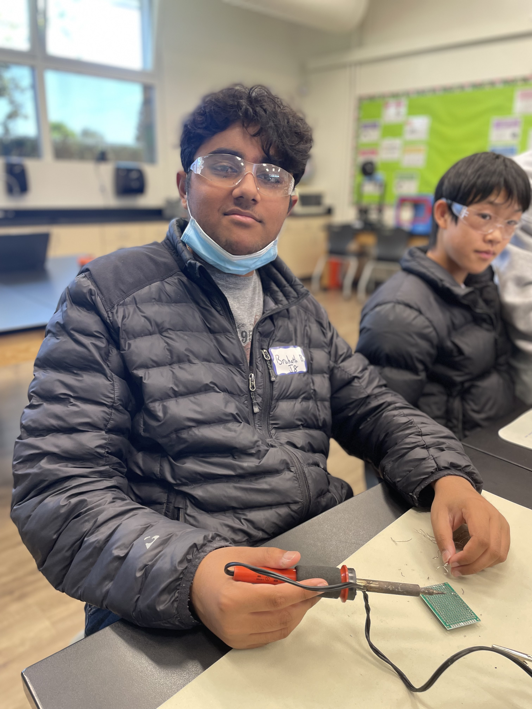
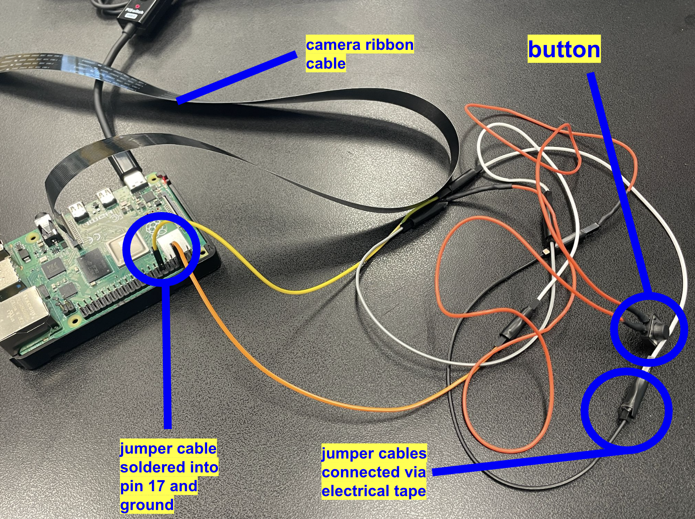
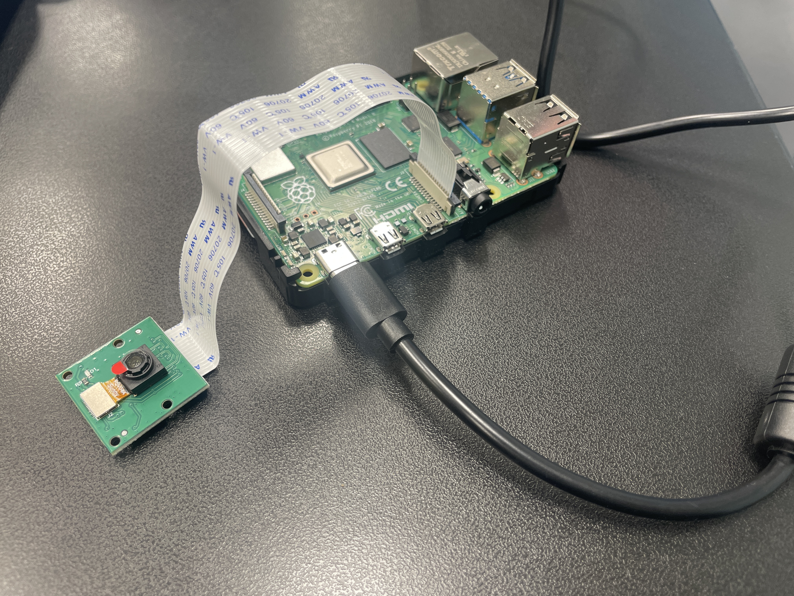
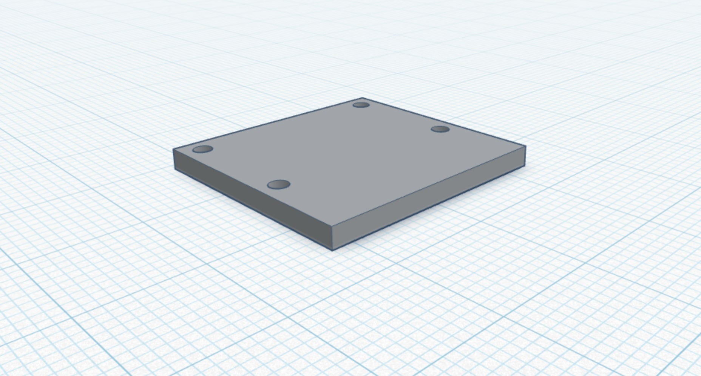
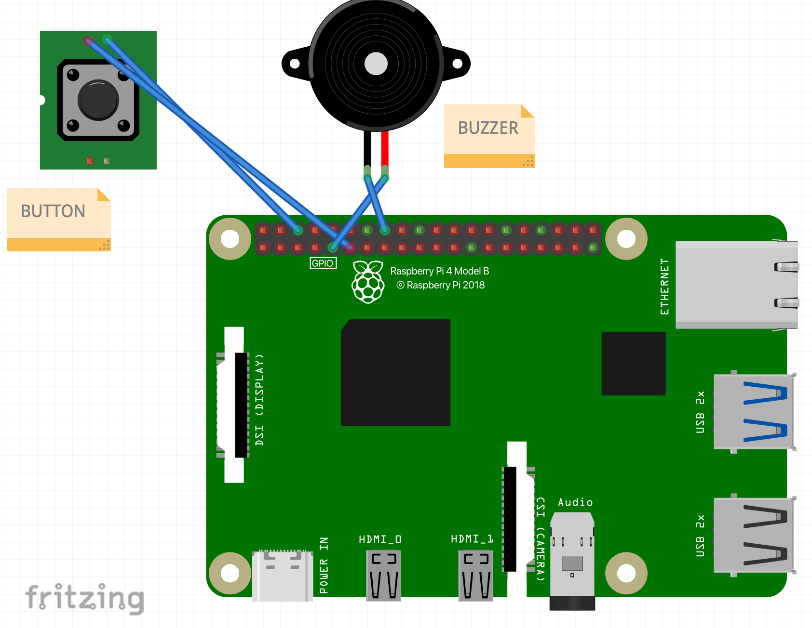

<!-- Description goes here -->
Inspired by cutting-edge wearable tech, these smart glasses are designed to enhance driver safety and connectivity. Equipped with real-time eye and head tracking, they detect signs of drowsiness or distraction and trigger alerts to keep drivers focused. At the same time, a built-in livestreaming feature lets users broadcast their perspective globally, merging safety with powerful remote visibility.


<iframe width="560" height="315" src="https://www.youtube.com/embed/M95Zjqw3O8w?si=IykWkUyauFiTGbkT" title="YouTube video player" frameborder="0" allow="accelerometer; autoplay; clipboard-write; encrypted-media; gyroscope; picture-in-picture; web-share" referrerpolicy="strict-origin-when-cross-origin" allowfullscreen></iframe>


| **Engineer** | **School** | **Area of Interest** | **Grade** |
|:--:|:--:|:--:|:--:|
| Bruhath B | Lynbrook High School | Electrical Engineering | Incoming Senior




# Modifications

<iframe width="560" height="315" src="https://www.youtube.com/embed/Fe1XffMTEk0?si=CDP0puDEEYwug5ww" title="YouTube video player" frameborder="0" allow="accelerometer; autoplay; clipboard-write; encrypted-media; gyroscope; picture-in-picture; web-share" referrerpolicy="strict-origin-when-cross-origin" allowfullscreen></iframe>

I’ve added two key modifications to my original smart glasses project, which already featured object recognition. The first is a livestreaming feature that enables a live video feed from the Raspberry Pi camera, accessible globally. The second is a driver alertness system powered by an external camera, which performs two tasks: it detects when the driver’s eyes remain closed for too long, triggering a loud buzzer to prevent drowsiness-related incidents, and it monitors the driver’s head orientation to ensure they are facing the road rather than being distracted to the side.

The livestreaming feature uses a tool called Ngrok. When I start the live streaming server on my laptop, it operates as a private server—meaning it’s only accessible locally for security reasons. Ngrok solves this limitation by creating a reverse tunnel, which is a secure outbound connection from my local server to Ngrok’s public servers on a designated port. This setup allows users from anywhere in the world to access my livestream through a public Ngrok link. When someone clicks the link, a request is sent to Ngrok’s servers, which then forwards it through the reverse tunnel to my private server. My server responds with the necessary HTML and image data, which Ngrok relays back to the user’s browser to render the livestream interface.

The driver alertness system leverages Google’s machine learning framework, MediaPipe. One of its components, called FaceMesh, generates a mesh over the human face with labeled 2- or 3-digit coordinates corresponding to key facial landmarks—such as the nose, chin, and eye corners. For the eye detection feature, I implemented the Eye Aspect Ratio (EAR) technique, which monitors the ratio between the horizontal and vertical eye distances. When this ratio drops below a certain threshold, it indicates eye closure. I use FaceMesh’s coordinates to compute the necessary distances in real time. Similarly, for head orientation, I calculate the midpoint between the farthest coordinates on the left and right sides of the face to form a reference vertical line. Then, I measure the displacement between this midpoint line and the nose coordinate. The sign of this displacement tells me whether the driver’s head is turned left or right. For example, a negative displacement indicates the nose has shifted to the left of the midpoint, meaning the head is turned to the right. 


# Third Milestone

<iframe width="560" height="315" src="https://www.youtube.com/embed/kHtmvWyE1ic?si=vUxc0lrhWm25VTFS" title="YouTube video player" frameborder="0" allow="accelerometer; autoplay; clipboard-write; encrypted-media; gyroscope; picture-in-picture; web-share" referrerpolicy="strict-origin-when-cross-origin" allowfullscreen></iframe>

For my third milestone, I added a photo and video capturing feature using a physical button connected to the Raspberry Pi. The button has two prongs that are soldered to wires, which are in turn connected to the GPIO pins on the Pi; pecifically, one wire goes to GPIO pin 17, and the other to a ground pin to complete the circuit. 

Here’s how it works: when I run the program and press the button, it takes a photo using the camera module and saves it to a folder on both the Raspberry Pi and my Google Drive. If I want to record a video instead, I just press and hold the button for more than 2 seconds. This triggers the video recording function in my code, and the camera continues recording as long as the button is held down. Once I release the button, the video automatically stops and is saved to the same folders as the photo.

The feature that saves the media to Google Drive works through a tool called rclone, which lets you manage files across multiple cloud services like Google Drive, OneDrive, Dropbox, and others. In my code, I use Python’s subprocess module to run external rclone commands that move the photo and video files to a specific folder in my Google Drive. To handle video recording properly, I had to implement an encoder. This is important because raw video data is massive, and without compression, it’s difficult to store or transfer. The encoder I used is H.264, which is a widely used standard that compresses video by eliminating redundant data and reducing file size while keeping good quality. Other encoders are available, but they’re usually designed for handling much larger data streams and would have been overkill for my project.

I faced a couple of challenges along the way. The first was figuring out which pins on the button to solder my wires to. I didn’t initially realize that the pins farthest apart on the button are always connected, whereas the adjacent pins only connect when the button is pressed, which was exactly the behavior I needed. Another issue came up with saving the video files: even though the terminal said the video was saved, nothing was showing up in the target folder. After some trial and error, I figured out that the problem was related to trying to convert the video from .h264 to .mp4 during the encoding process. This caused some logical conflicts that prevented the video from saving properly. I fixed the issue by modifying the code so that the conversion to .mp4 only happens after the recording is complete, not during. Once I made that change, the videos finally showed up in the folder, although it took a fair bit of debugging and thinking through the logic to pinpoint the issue.




# Second Milestone

<iframe width="560" height="315" src="https://www.youtube.com/embed/531uo7BknMI?si=yAc8GAReueCnoRzo" title="YouTube video player" frameborder="0" allow="accelerometer; autoplay; clipboard-write; encrypted-media; gyroscope; picture-in-picture; web-share" referrerpolicy="strict-origin-when-cross-origin" allowfullscreen></iframe>

For my second milestone, I set up the object recognition algorithm using a machine learning framework called TensorFlow, which I installed on the Raspberry Pi. With TensorFlow, when I point the camera at an object--such as a laptop, coffee mug, or telephone--a label appears on the screen identifying what the object is in real time. The model I used is a pre-trained one called MobileNetV2, developed by Google. Since it's pre-trained, it has already been exposed to thousands of images of around 80 to 100 common objects and has learned to recognize their unique patterns and features. These include everyday items like a keyboard, mouse, phone, and more.

Additionally, in order to integrate the camera into the project, I designed and 3D-printed a simple mount that attaches directly to the glasses. The camera is secured to the mount with screws, and the mount is attached to the glasses using hot glue. One of the challenges I faced was dealing with camera errors while running the object recognition algorithm. I accidentally damaged the camera by handling it improperly and had to replace it. Another hurdle was figuring out how to mount the camera to the glasses securely. After experimenting with tape and the default camera case, I decided that designing a custom 3D-printed mount was the best solution.


# First Milestone

<iframe width="560" height="315" src="https://www.youtube.com/embed/aelxbT13E-M?si=j0CjPNI0-CN-dHPi" title="YouTube video player" frameborder="0" allow="accelerometer; autoplay; clipboard-write; encrypted-media; gyroscope; picture-in-picture; web-share" referrerpolicy="strict-origin-when-cross-origin" allowfullscreen></iframe>

For my first milestone, I set up my Raspberry Pi by displaying it to my laptop via a software called TigerVNC which allows me to remotely stream the pi to my laptop screen to see what's going on on the raspberry pi's UI. I also did a headless setup called SSH (secure shell) which allows me to remotely run commands on my raspberry pi and essentially make it do things such as taking a photo all through VS Code without requiring a display on a monitor of the pi. To do this, my laptop and the raspberry pi have to be on the same network, and remotely programming the pi requires specifying which port to use on VS Code so that we can reach the pi's SSH server.

Additionally, I set up the photo-taking feature of the Raspberry Pi through a couple of lines of code which used Python's Picamera2 library which allows me to access the built-in camera feature of the Pi and take a photo upon running the software. The camera used is a special Raspberry Pi camera module which is attached to the Pi through a ribbon-like cable/wire. OpenCV, which is a real-time computer vision and machine learning software, had to be donwloaded in order to save the image taken by the camera onto an SD card which is also attached to the Pi.



# Schematics 


Above is the simple design for the camera mount to the glasses.



Above diagram shows which GPIO pins I connected my button and buzzer to my Raspberry Pi.


# Starter Project: Retro Arcade Game

<iframe width="560" height="315" src="https://www.youtube.com/embed/z90Ao1cDq40?si=WT4S7g19cpYrOn5E" title="YouTube video player" frameborder="0" allow="accelerometer; autoplay; clipboard-write; encrypted-media; gyroscope; picture-in-picture; web-share" referrerpolicy="strict-origin-when-cross-origin" allowfullscreen></iframe>

I chose to complete the Retro Arcade Game for my starter project because I thought that building a game device which I could play on my own time was pretty cool. Additionally, as stated in the video, I thought that the Retro Arcade Game would be a rather intriciate/difficult project to start with, and is great practice for my soldering technique as there were many parts that had to be properly soldered and in tight spaces as well. The arcade game has multiple pre-coded games such as Tetris and Snake and here's how it works:

- Multiple components such as buttons (directions, on/off, gamemode change), a buzzer, a score display, the game board, a USB-mini socket (for power), and a battery pack are all soldered onto a PCB.
- The PCB has an STC microprocessor which processes input from all the buttons when pressed, and also stores and runs code which contains the different games mentioned above.
- The button actions are processed by the microprocessor through copper traces that are printed on the PCB; the button completes the current that is passing through the resistor and the battery, and when the current is completed, a signal is sent to the microprocessor to complete in action, which can be as simple as scrolling through the games, or rotating a piece in Tetris.

# Code

```python
# The code below is for my modifications to the smart glasses project.

# This first chunk of code is for the photo/video feature with a button on my Raspberry Pi.

from gpiozero import Button
from picamera2 import Picamera2
from datetime import datetime
from picamera2.encoders import H264Encoder
from picamera2.outputs import FfmpegOutput
import time
import os
import cv2
import subprocess
import threading

button = Button(17, pull_up=True, bounce_time=0.05) # Resistor added to ensure no false button presses
picam2 = Picamera2()

picam2.configure(picam2.create_still_configuration())
picam2.start()

save_folder = "/home/bru/button_photos" # Folder where photos/videos are stored
os.makedirs(save_folder, exist_ok=True)

encoder = H264Encoder(bitrate=10000000)
output = None

press_time = None
recording = False
check_hold_thread = None

def take_photo():
    print("Capturing photo...")
    time.sleep(0.5)
    im = picam2.capture_array()
    im = cv2.cvtColor(im, cv2.COLOR_BGR2RGB)
    timestamp = datetime.now().strftime("%Y-%m-%d_%H-%M-%S")
    filepath = os.path.join(save_folder, f"{timestamp}.jpg")
    cv2.imwrite(filepath, im)
    print(f"Photo saved to {filepath}")
    subprocess.run(["rclone", "copy", filepath, "gdrive:button_photos_pi"]) # Uses rclone raspberry pi package to upload to google drive
    print("Photo uploaded to GDrive.")
    print("Ready.")

def start_video():
    global recording, video_filepath_h264
    recording = True
    print("Starting video recording...")

    timestamp = datetime.now().strftime("%Y-%m-%d_%H-%M-%S")
    video_filepath_h264 = os.path.join(save_folder, f"{timestamp}.h264")
    print(f"Saving raw video to: {video_filepath_h264}")

    picam2.stop()
    video_config = picam2.create_video_configuration()
    picam2.configure(video_config)
    picam2.start()

    try:
        picam2.start_recording(encoder, video_filepath_h264)
        print("Recording started.")
    except Exception as e:
        print(f"Error starting recording: {e}")
        recording = False

def stop_video():
    global recording, video_filepath_h264
    if recording:
        print("Stopping video recording...")
        try:
            picam2.stop_recording()
            time.sleep(1)  # Let it flush
            print("Recording stopped.")
        except Exception as e:
            print(f"Error stopping recording: {e}")

        # Convert to MP4 using ffmpeg
        mp4_filepath = video_filepath_h264.replace(".h264", ".mp4")
        print(f"Converting {video_filepath_h264} to {mp4_filepath}...")
        try:
            subprocess.run([
                "ffmpeg", "-y", "-framerate", "30",
                "-i", video_filepath_h264,
                "-c", "copy", mp4_filepath
            ], check=True)
            print("Conversion to MP4 completed.")
        except subprocess.CalledProcessError as e:
            print(f"FFmpeg conversion failed: {e}")

        picam2.stop()
        picam2.configure(picam2.create_still_configuration())
        picam2.start()
        recording = False
        print("Camera reset to photo mode.")

        subprocess.run(["rclone", "copy", mp4_filepath, "gdrive:button_photos_pi"])
        print("Video uploaded to GDrive.")
        print("Ready.")
    else:
        print("Stop called but recording was not active.")


def check_hold():
    global press_time, recording

    while button.is_pressed:
        elapsed = time.time() - press_time
        if elapsed >= 2 and not recording:
            start_video()
            break
        time.sleep(0.05)

def handle_press():
    global press_time, check_hold_thread
    press_time = time.time()
    print("Button pressed, waiting to determine action...")
    check_hold_thread = threading.Thread(target=check_hold)
    check_hold_thread.start()

def handle_release():
    global recording, check_hold_thread
    hold_time = time.time() - press_time
    print(f"Button released after {hold_time:.2f} seconds.")

    if recording:
        stop_video()
    else:
        if hold_time < 2:
            take_photo()
    if check_hold_thread:
        check_hold_thread.join()

button.when_pressed = handle_press
button.when_released = handle_release

print("Ready. Tap for photo, hold for video (>2s).")
try:
    while True:
        time.sleep(0.1)
except KeyboardInterrupt:
    print("Exiting.")

#------BELOW IS CODE FOR THE LIVESTREAMING FEATURE---------------------------------------------------------------

from flask import Flask, render_template, Response
from picamera2 import Picamera2
import cv2
import time

app = Flask(__name__)

# Initialize camera
picam2 = Picamera2()
picam2.configure(picam2.create_video_configuration(main={"size": (1280, 720)}))
picam2.start()

time.sleep(1)  # Let the camera warm up

def generate_frames():
    while True:
        frame = picam2.capture_array()

        frame = cv2.cvtColor(frame, cv2.COLOR_BGR2RGB)
        # Encode to JPEG
        _, buffer = cv2.imencode('.jpg', frame)
        frame_bytes = buffer.tobytes()

        # MJPEG Stream
        yield (b'--frame\r\n'
               b'Content-Type: image/jpeg\r\n\r\n' + frame_bytes + b'\r\n')

@app.route('/')
def index():
    return render_template('index.html')  # HTML page


@app.route('/video_feed')
def video_feed():
    return Response(generate_frames(),
                    mimetype='multipart/x-mixed-replace; boundary=frame')

if __name__ == "__main__":
    app.run(host='0.0.0.0', port=5000, debug=False)

#-----BELOW IS CODE FOR THE UI OF THE WEBSITE IN HTML--------------------------------------------------------------------------------

<!DOCTYPE html>
<html>
<head>
    <title>Bruhath's Live Feed</title>
    <style>
        body { text-align: center; background-color: #111; color: #fff; font-family: Arial, sans-serif; }
        h1 { margin-top: 20px; }
        #loading { font-size: 36px; margin-top: 50px; }
    </style>
</head>
<body>
    <h1>Bruhath's Live Feed</h1>
    <div id="loading">Please wait...</div>
    

    <script>
        const video = document.getElementById('video');
        const loading = document.getElementById('loading');

        video.onload = function() {
            loading.style.display = 'none';
            video.style.display = 'block';
        };
    </script>
</body>
</html>

#------BELOW IS CODE FOR THE BLINK DETECTION SYSTEM WITH A BUZZER--------------------------------------------------------------------------------------

import cv2
import mediapipe as mp
import numpy as np
import RPi.GPIO as GPIO
import time

BUZZER_PIN = 23
GPIO.setmode(GPIO.BCM)
GPIO.setup(BUZZER_PIN, GPIO.OUT)

# Eye aspect ratio threshold
EYE_AR_THRESHOLD = 0.2
EYE_CLOSED_DURATION_THRESHOLD = 0.4

# Initialize MediaPipe Face Mesh
mp_face_mesh = mp.solutions.face_mesh
face_mesh = mp_face_mesh.FaceMesh(static_image_mode=False, max_num_faces=1, refine_landmarks=True)

# USB camera
cap = cv2.VideoCapture(0)

# Eye landmark indices for the right eye and left eye (MediaPipe indices)
RIGHT_EYE = [33, 160, 158, 133, 153, 144]
LEFT_EYE = [362, 385, 387, 263, 373, 380]

def aspect_ratio(landmarks, eye_indices):
    points = np.array([[landmarks[i].x, landmarks[i].y] for i in eye_indices])
    # Horizontal distance
    hor_dist = np.linalg.norm(points[0] - points[3])
    # Vertical distance
    ver_dist1 = np.linalg.norm(points[1] - points[5])
    ver_dist2 = np.linalg.norm(points[2] - points[4])
    ver_dist = (ver_dist1 + ver_dist2) / 2.0
    return ver_dist / hor_dist

eyes_closed_start_time = None
buzzer_on = False


while True:
    ret, frame = cap.read()
    if not ret:
        break

    # Flip frame for selfie view
    frame = cv2.flip(frame, 1)
    rgb_frame = cv2.cvtColor(frame, cv2.COLOR_BGR2RGB)

    results = face_mesh.process(rgb_frame)

    status = "No Face Detected"

    if results.multi_face_landmarks:
        landmarks = results.multi_face_landmarks[0].landmark

        # Calculate Eye Aspect Ratio for both eyes
        right_eye_ar = aspect_ratio(landmarks, RIGHT_EYE)
        left_eye_ar = aspect_ratio(landmarks, LEFT_EYE)
        avg_eye_ar = (right_eye_ar + left_eye_ar) / 2.0

        current_time = time.time()

        # Check if eyes are open or closed
        if avg_eye_ar < EYE_AR_THRESHOLD:
            status = "Eyes Closed"
            if eyes_closed_start_time is None:
                eyes_closed_start_time = current_time

            elapsed_time = current_time - eyes_closed_start_time

            if elapsed_time >= EYE_CLOSED_DURATION_THRESHOLD:
                status = "Eyes Closed"
                if  not buzzer_on:
                    GPIO.output(BUZZER_PIN, GPIO.HIGH)
                    buzzer_on = True
            else:
                status = f"Eyes-Closed - {elapsed_time:.1f}s"

        else:
            eyes_closed_start_time = None
            if buzzer_on:
                GPIO.output(BUZZER_PIN, GPIO.LOW)
                buzzer_on = False

            status = "Eyes Open"
        time.sleep(0.1)
        # Draw status text
        cv2.putText(frame, status, (50, 50), cv2.FONT_HERSHEY_SIMPLEX, 1.2, (0, 255, 0), 3)

    cv2.imshow("Eye State Detection", frame)

    if cv2.waitKey(1) & 0xFF == ord('q'):
        break

cap.release()
cv2.destroyAllWindows()
GPIO.cleanup()

#----------------------BELOW IS THE CODE FOR THE HEAD POSIITON FEATURE-------------------------------------------------------

import cv2
import mediapipe as mp
import numpy as np
import RPi.GPIO as GPIO
import time

# Setup GPIO
BUZZER_PIN = 23
GPIO.setmode(GPIO.BCM)
GPIO.setup(BUZZER_PIN, GPIO.OUT)

# Initialize MediaPipe
mp_face_mesh = mp.solutions.face_mesh
face_mesh = mp_face_mesh.FaceMesh(static_image_mode=False, max_num_faces=1, refine_landmarks=True)

cap = cv2.VideoCapture(0)

# Landmark indices
NOSE = 1
LEFT_FACE = 234
RIGHT_FACE = 454
FOREHEAD = 10
CHIN = 152

# Thresholds
YAW_THRESHOLD = 0.05   # Left/right head turn sensitivity
PITCH_THRESHOLD = 0.1  # Downward tilt sensitivity
HEAD_TURN_DURATION = 3.0  # seconds

# Timing variables
head_turn_start_time = None
buzzer_on = False
current_status = "Looking Straight"

while True:
    ret, frame = cap.read()
    if not ret:
        break

    frame = cv2.flip(frame, 1)  # Mirror view
    rgb_frame = cv2.cvtColor(frame, cv2.COLOR_BGR2RGB)
    results = face_mesh.process(rgb_frame)

    current_time = time.time()

    if results.multi_face_landmarks:
        landmarks = results.multi_face_landmarks[0].landmark

        nose_x = landmarks[NOSE].x
        left_x = landmarks[LEFT_FACE].x
        right_x = landmarks[RIGHT_FACE].x

        # Compute yaw (left/right turn)
        face_center_x = (left_x + right_x) / 2
        offset_x = nose_x - face_center_x

        # Compute pitch (up/down tilt)
        nose_y = landmarks[NOSE].y
        chin_y = landmarks[CHIN].y
        forehead_y = landmarks[FOREHEAD].y

        # Distance checks
        down_ratio = (chin_y - nose_y) / (nose_y - forehead_y)

        # Determine head direction
        if offset_x < -YAW_THRESHOLD:
            new_status = "Head Turned Right"
        elif offset_x > YAW_THRESHOLD:
            new_status = "Head Turned Left"
        elif down_ratio > (1.0 + PITCH_THRESHOLD):
            new_status = "Head Tilted Down"
        else:
            new_status = "Looking Straight"

        # Handle timing for prolonged head turns
        if new_status != "Looking Straight":
            if head_turn_start_time is None:
                head_turn_start_time = current_time
            else:
                elapsed = current_time - head_turn_start_time
                if elapsed >= HEAD_TURN_DURATION:
                    if not buzzer_on:
                        GPIO.output(BUZZER_PIN, GPIO.HIGH)
                        buzzer_on = True
        else:
            head_turn_start_time = None
            if buzzer_on:
                GPIO.output(BUZZER_PIN, GPIO.LOW)
                buzzer_on = False

        current_status = new_status

        # Display text
        cv2.putText(frame, current_status, (50, 50), cv2.FONT_HERSHEY_SIMPLEX, 1.2, (0, 255, 0), 3)
        if new_status != "Looking Straight":
            if head_turn_start_time is None:
                head_turn_start_time = current_time
            else:
                elapsed = current_time - head_turn_start_time
                if elapsed >= HEAD_TURN_DURATION:
                    if not buzzer_on:
                        GPIO.output(BUZZER_PIN, GPIO.HIGH)
                        buzzer_on = True
        else:
            head_turn_start_time = None
            if buzzer_on:
                GPIO.output(BUZZER_PIN, GPIO.LOW)
                buzzer_on = False


    else:
        cv2.putText(frame, "No Face Detected", (50, 50), cv2.FONT_HERSHEY_SIMPLEX, 1.2, (0, 0, 255), 3)
  
    cv2.imshow("Head Direction Detection", frame) 

    if cv2.waitKey(1) & 0xFF == ord('q'):
        break

# Cleanup
cap.release()
cv2.destroyAllWindows()
GPIO.cleanup()

```

# Bill of Materials

| **Part** | **Note** | **Price** | **Link** |
|:--:|:--:|:--:|:--:|
| Raspberry Pi 4 Kit | Computer that handles image processing and system control for the glasses| $119.95 | <a href="https://www.canakit.com/raspberry-pi-4-starter-kit.html"> Link </a> |
| Raspberry Pi Camera Module | Captures images to be input into the Raspberry Pi | $9.99 | <a href="https://www.amazon.com/Arducam-Raspberry-Camera-Module-1080P/dp/B07RWCGX5K/ref=asc_df_B07RWCGX5K?mcid=ac983c0aeb843492a7f6d48d54a3e05a&hvocijid=1425345951002749708-B07RWCGX5K-&hvexpln=73&tag=hyprod-20&linkCode=df0&hvadid=721245378154&hvpos=&hvnetw=g&hvrand=1425345951002749708&hvpone=&hvptwo=&hvqmt=&hvdev=c&hvdvcmdl=&hvlocint=&hvlocphy=9032183&hvtargid=pla-2281435178818&th=1"> Link </a> |
| Clear glasses | Main glasses upon which camera is mounted| $6.59 | <a href="https://www.amazon.com/Glasses-Bluelight-Womens-Blocking-Gaming/dp/B0D47J1P9L/ref=sr_1_4?crid=2U3JX46PP1YQ5&dib=eyJ2IjoiMSJ9.rK2Oq1Z75QQhRq6f0QUoxqu4RsrvvN4-7uOkvUycMizXug5d4rAzL0z5PYOZFd_ZxeiS3fj5JgF00Towo1kwJ_NzLM2nu5C2rMZ3tbi_u94h5O5WOaiHfNMs3VvmwcqPp183FNb-nwuow9nJbUC1Jq211HxtHQXrS8O5Hqn4j9k0EUB6_3Lnv1LlQQbhrrLfn6WayrraOMVG-r3ejjSLZopIFf8Hu40h-MDKOgiEx2LG0YobFUMAlZZdmM_CsmwBDZWsi2Q2pWGLhHNNl0zK2WscFNvbiXytO5p3skOWIgo.-60dL36sVlGRKSMy3k-XOQvnLa_vUMN-R1Vk1S5eDrg&dib_tag=se&keywords=clear%2Bbluelight%2Bglasses&qid=1751488889&s=electronics&sprefix=clear%2Bbluelight%2Bglasses%2Celectronics%2C221&sr=1-4&th=1"> Link </a> |
| Power bank | Mobile power source for Raspberry Pi| $21.99 | <a href="https://www.amazon.com/INIU-High-Speed-Flashlight-Powerbank-Compatible/dp/B07CZDXDG8/ref=sr_1_3?crid=53URT6OP6FHU&dib=eyJ2IjoiMSJ9.QKGsYnUA7w9IYsHtGbbDBqIPNqk72m127EvLDj4h4xbK4PihUjQsjylRthVPXKduCEGzyUpg7f3q0NPty07_-KFT7T5qr__K57D5hRdcXoHELBfMdok_E_9y1Df1063YsnHjxpRKS_a398z0ONZphacjUTxCOIzKHFdBBrsFpfkb790Sw_pyPRSDa7rArLGqoH6P9PGsHUxtRCI7lsx3nkImJOaF1GeY9Apk7IPch8754krUzQFSrwshZ8RLcLZSVmf0nZDSr6gLtz1VABsNEapXiItDG5V8GMGgI8JPnDk.IsEEt-fYtmCt4CweTWkltJF8zsH_XhjGRX3EqgUwA7A&dib_tag=se&keywords=iniu%2Bpower%2Bbank&qid=1751488984&s=electronics&sprefix=iniu%2Bpower%2Bba%2Celectronics%2C370&sr=1-3&th=1"> Link </a> |
| HDMI Video Capture Card | To interact with Raspberry Pi UI on external monitor| $9.98 | <a href="https://www.amazon.com/Audio-Express-AXHDCAP-Broadcasting-Conference/dp/B0C2MDTY8P/ref=sr_1_3?crid=2BX43CAYPODYE&dib=eyJ2IjoiMSJ9.jqv_PPTyMd5Yw9Wlfle7WftEF62bGg5qpcOk2xxrMPt2e4ZaBTNSBKUvKtLs6u3XEsd8GOnOALOi5SmrKqx_Twh0IGnbvwjg8xxyFuOfBoOuWCn4SmQPPg7--XyFTzopqrZ2sDhggg-bG-HP1zU6PxAzcCMx6LCSos0grBFNFvNZGRiw5zstmF16TSbhjujUgW5Cfy55zxO4Lxlq6XhzFxzqOvQJ5xltH-ki3b5qm0DckQHTlDXYzFt4fq02lei5UGEBSp-Whti9gAz7Z3qbUEqcsv_3dgxv4zsxz1n7Ck8.rfTcXMY_ExQTQji5B6Zh7YL4levLc6MyTa2Bm3rt7Bg&dib_tag=se&keywords=hdmi+video+capture+card&qid=1751489136&s=electronics&sprefix=hdmi+video+capture+car%2Celectronics%2C190&sr=1-3"> Link </a> |

<!-- # Other Resources/Examples -->

