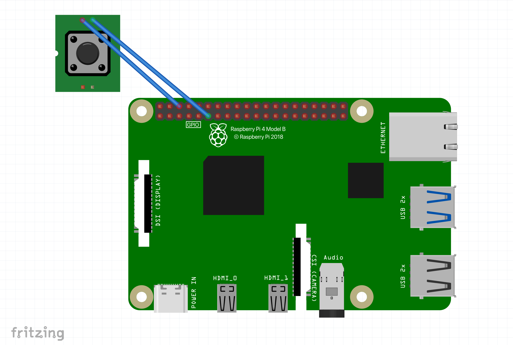

<!-- Description goes here -->
Inspired by the high-tech surveillance glasses in James Bond films and Meta’s next-gen AI eyewear, these smart glasses bring spy-level functionality to everyday life. With a single button, you can snap photos or record videos, automatically uploading them to Google Drive, while real-time object detection narrates your surroundings using text-to-speech.

| **Engineer** | **School** | **Area of Interest** | **Grade** |
|:--:|:--:|:--:|:--:|
| Bruhath B | Lynbrook High School | Computer Engineering | Incoming Senior


  
<!-- # Final Milestone -->

# Third Milestone

<iframe width="560" height="315" src="https://www.youtube.com/embed/kHtmvWyE1ic?si=vUxc0lrhWm25VTFS" title="YouTube video player" frameborder="0" allow="accelerometer; autoplay; clipboard-write; encrypted-media; gyroscope; picture-in-picture; web-share" referrerpolicy="strict-origin-when-cross-origin" allowfullscreen></iframe>

For my third milestone, I added a photo and video capturing feature using a physical button connected to the Raspberry Pi. The button has two prongs that are soldered to wires, which are in turn connected to the GPIO pins on the Pi; pecifically, one wire goes to GPIO pin 17, and the other to a ground pin to complete the circuit. 

Here’s how it works: when I run the program and press the button, it takes a photo using the camera module and saves it to a folder on both the Raspberry Pi and my Google Drive. If I want to record a video instead, I just press and hold the button for more than 2 seconds. This triggers the video recording function in my code, and the camera continues recording as long as the button is held down. Once I release the button, the video automatically stops and is saved to the same folders as the photo.

The feature that saves the media to Google Drive works through a tool called rclone, which lets you manage files across multiple cloud services like Google Drive, OneDrive, Dropbox, and others. In my code, I use Python’s subprocess module to run external rclone commands that move the photo and video files to a specific folder in my Google Drive. To handle video recording properly, I had to implement an encoder. This is important because raw video data is massive, and without compression, it’s difficult to store or transfer. The encoder I used is H.264, which is a widely used standard that compresses video by eliminating redundant data and reducing file size while keeping good quality. Other encoders are available, but they’re usually designed for handling much larger data streams and would have been overkill for my project.

I faced a couple of challenges along the way. The first was figuring out which pins on the button to solder my wires to. I didn’t initially realize that the pins farthest apart on the button are always connected, whereas the adjacent pins only connect when the button is pressed, which was exactly the behavior I needed. Another issue came up with saving the video files: even though the terminal said the video was saved, nothing was showing up in the target folder. After some trial and error, I figured out that the problem was related to trying to convert the video from .h264 to .mp4 during the encoding process. This caused some logical conflicts that prevented the video from saving properly. I fixed the issue by modifying the code so that the conversion to .mp4 only happens after the recording is complete, not during. Once I made that change, the videos finally showed up in the folder, although it took a fair bit of debugging and thinking through the logic to pinpoint the issue.


# Second Milestone

<iframe width="560" height="315" src="https://www.youtube.com/embed/531uo7BknMI?si=yAc8GAReueCnoRzo" title="YouTube video player" frameborder="0" allow="accelerometer; autoplay; clipboard-write; encrypted-media; gyroscope; picture-in-picture; web-share" referrerpolicy="strict-origin-when-cross-origin" allowfullscreen></iframe>

For my second milestone, I set up the object recognition algorithm using a machine learning framework called TensorFlow, which I installed on the Raspberry Pi. With TensorFlow, when I point the camera at an object--such as a laptop, coffee mug, or telephone--a label appears on the screen identifying what the object is in real time. The model I used is a pre-trained one called MobileNetV2, developed by Google. Since it's pre-trained, it has already been exposed to thousands of images of around 80 to 100 common objects and has learned to recognize their unique patterns and features. These include everyday items like a keyboard, mouse, phone, and more.

Additionally, in order to integrate the camera into the project, I designed and 3D-printed a simple mount that attaches directly to the glasses. The camera is secured to the mount with screws, and the mount is attached to the glasses using hot glue. One of the challenges I faced was dealing with camera errors while running the object recognition algorithm. I accidentally damaged the camera by handling it improperly and had to replace it. Another hurdle was figuring out how to mount the camera to the glasses securely. After experimenting with tape and the default camera case, I decided that designing a custom 3D-printed mount was the best solution.


# First Milestone

<iframe width="560" height="315" src="https://www.youtube.com/embed/aelxbT13E-M?si=j0CjPNI0-CN-dHPi" title="YouTube video player" frameborder="0" allow="accelerometer; autoplay; clipboard-write; encrypted-media; gyroscope; picture-in-picture; web-share" referrerpolicy="strict-origin-when-cross-origin" allowfullscreen></iframe>

For my first milestone, I set up my Raspberry Pi by displaying it to my laptop via a software called TigerVNC which allows me to remotely stream the pi to my laptop screen to see what's going on on the raspberry pi's UI. I also did a headless setup called SSH (secure shell) which allows me to remotely run commands on my raspberry pi and essentially make it do things such as taking a photo all through VS Code without requiring a display on a monitor of the pi. To do this, my laptop and the raspberry pi have to be on the same network, and remotely programming the pi requires specifying which port to use on VS Code so that we can reach the pi's SSH server.

Additionally, I set up the photo-taking feature of the Raspberry Pi through a couple of lines of code which used Python's Picamera2 library which allows me to access the built-in camera feature of the Pi and take a photo upon running the software. The camera used is a special Raspberry Pi camera module which is attached to the Pi through a ribbon-like cable/wire. OpenCV, which is a real-time computer vision and machine learning software, had to be donwloaded in order to save the image taken by the camera onto an SD card which is also attached to the Pi.


# Schematics 


Above is the simple design for the camera mount to the glasses.



Simple schematic which shows which exact GPIO pins I connected to the push button.


# Starter Project: Retro Arcade Game

<iframe width="560" height="315" src="https://www.youtube.com/embed/z90Ao1cDq40?si=WT4S7g19cpYrOn5E" title="YouTube video player" frameborder="0" allow="accelerometer; autoplay; clipboard-write; encrypted-media; gyroscope; picture-in-picture; web-share" referrerpolicy="strict-origin-when-cross-origin" allowfullscreen></iframe>

I chose to complete the Retro Arcade Game for my starter project because I thought that building a game device which I could play on my own time was pretty cool. Additionally, as stated in the video, I thought that the Retro Arcade Game would be a rather intriciate/difficult project to start with, and is great practice for my soldering technique as there were many parts that had to be properly soldered and in tight spaces as well. The arcade game has multiple pre-coded games such as Tetris and Snake and here's how it works:

- Multiple components such as buttons (directions, on/off, gamemode change), a buzzer, a score display, the game board, a USB-mini socket (for power), and a battery pack are all soldered onto a PCB.
- The PCB has an STC microprocessor which processes input from all the buttons when pressed, and also stores and runs code which contains the different games mentioned above.
- The button actions are processed by the microprocessor through copper traces that are printed on the PCB; the button completes the current that is passing through the resistor and the battery, and when the current is completed, a signal is sent to the microprocessor to complete in action, which can be as simple as scrolling through the games, or rotating a piece in Tetris.

# Code

```python
from gpiozero import Button
from picamera2 import Picamera2
from datetime import datetime
from picamera2.encoders import H264Encoder
from picamera2.outputs import FfmpegOutput
import time
import os
import cv2
import subprocess
import threading

button = Button(17, pull_up=True, bounce_time=0.05) # Resistor added to ensure no false button presses
picam2 = Picamera2()

picam2.configure(picam2.create_still_configuration())
picam2.start()

save_folder = "/home/bru/button_photos" # Folder where photos/videos are stored
os.makedirs(save_folder, exist_ok=True)

encoder = H264Encoder(bitrate=10000000)
output = None

press_time = None
recording = False
check_hold_thread = None

def take_photo():
    print("Capturing photo...")
    time.sleep(0.5)
    im = picam2.capture_array()
    im = cv2.cvtColor(im, cv2.COLOR_BGR2RGB)
    timestamp = datetime.now().strftime("%Y-%m-%d_%H-%M-%S")
    filepath = os.path.join(save_folder, f"{timestamp}.jpg")
    cv2.imwrite(filepath, im)
    print(f"Photo saved to {filepath}")
    subprocess.run(["rclone", "copy", filepath, "gdrive:button_photos_pi"]) # Uses rclone raspberry pi package to upload to google drive
    print("Photo uploaded to GDrive.")
    print("Ready.")

def start_video():
    global recording, video_filepath_h264
    recording = True
    print("Starting video recording...")

    timestamp = datetime.now().strftime("%Y-%m-%d_%H-%M-%S")
    video_filepath_h264 = os.path.join(save_folder, f"{timestamp}.h264")
    print(f"Saving raw video to: {video_filepath_h264}")

    picam2.stop()
    video_config = picam2.create_video_configuration()
    picam2.configure(video_config)
    picam2.start()

    try:
        picam2.start_recording(encoder, video_filepath_h264)
        print("Recording started.")
    except Exception as e:
        print(f"Error starting recording: {e}")
        recording = False

def stop_video():
    global recording, video_filepath_h264
    if recording:
        print("Stopping video recording...")
        try:
            picam2.stop_recording()
            time.sleep(1)  # Let it flush
            print("Recording stopped.")
        except Exception as e:
            print(f"Error stopping recording: {e}")

        # Convert to MP4 using ffmpeg
        mp4_filepath = video_filepath_h264.replace(".h264", ".mp4")
        print(f"Converting {video_filepath_h264} to {mp4_filepath}...")
        try:
            subprocess.run([
                "ffmpeg", "-y", "-framerate", "30",
                "-i", video_filepath_h264,
                "-c", "copy", mp4_filepath
            ], check=True)
            print("Conversion to MP4 completed.")
        except subprocess.CalledProcessError as e:
            print(f"FFmpeg conversion failed: {e}")

        picam2.stop()
        picam2.configure(picam2.create_still_configuration())
        picam2.start()
        recording = False
        print("Camera reset to photo mode.")

        subprocess.run(["rclone", "copy", mp4_filepath, "gdrive:button_photos_pi"])
        print("Video uploaded to GDrive.")
        print("Ready.")
    else:
        print("Stop called but recording was not active.")


def check_hold():
    global press_time, recording

    while button.is_pressed:
        elapsed = time.time() - press_time
        if elapsed >= 2 and not recording:
            start_video()
            break
        time.sleep(0.05)

def handle_press():
    global press_time, check_hold_thread
    press_time = time.time()
    print("Button pressed, waiting to determine action...")
    check_hold_thread = threading.Thread(target=check_hold)
    check_hold_thread.start()

def handle_release():
    global recording, check_hold_thread
    hold_time = time.time() - press_time
    print(f"Button released after {hold_time:.2f} seconds.")

    if recording:
        stop_video()
    else:
        if hold_time < 2:
            take_photo()
    if check_hold_thread:
        check_hold_thread.join()

button.when_pressed = handle_press
button.when_released = handle_release

print("Ready. Tap for photo, hold for video (>2s).")
try:
    while True:
        time.sleep(0.1)
except KeyboardInterrupt:
    print("Exiting.")
```

# Bill of Materials

| **Part** | **Note** | **Price** | **Link** |
|:--:|:--:|:--:|:--:|
| Raspberry Pi 4 Kit | Computer that handles image processing and system control for the glasses| $119.95 | <a href="https://www.canakit.com/raspberry-pi-4-starter-kit.html"> Link </a> |
| Raspberry Pi Camera Module | Captures images to be input into the Raspberry Pi | $9.99 | <a href="https://www.amazon.com/Arducam-Raspberry-Camera-Module-1080P/dp/B07RWCGX5K/ref=asc_df_B07RWCGX5K?mcid=ac983c0aeb843492a7f6d48d54a3e05a&hvocijid=1425345951002749708-B07RWCGX5K-&hvexpln=73&tag=hyprod-20&linkCode=df0&hvadid=721245378154&hvpos=&hvnetw=g&hvrand=1425345951002749708&hvpone=&hvptwo=&hvqmt=&hvdev=c&hvdvcmdl=&hvlocint=&hvlocphy=9032183&hvtargid=pla-2281435178818&th=1"> Link </a> |
| Clear glasses | Main glasses upon which camera is mounted| $6.59 | <a href="https://www.amazon.com/Glasses-Bluelight-Womens-Blocking-Gaming/dp/B0D47J1P9L/ref=sr_1_4?crid=2U3JX46PP1YQ5&dib=eyJ2IjoiMSJ9.rK2Oq1Z75QQhRq6f0QUoxqu4RsrvvN4-7uOkvUycMizXug5d4rAzL0z5PYOZFd_ZxeiS3fj5JgF00Towo1kwJ_NzLM2nu5C2rMZ3tbi_u94h5O5WOaiHfNMs3VvmwcqPp183FNb-nwuow9nJbUC1Jq211HxtHQXrS8O5Hqn4j9k0EUB6_3Lnv1LlQQbhrrLfn6WayrraOMVG-r3ejjSLZopIFf8Hu40h-MDKOgiEx2LG0YobFUMAlZZdmM_CsmwBDZWsi2Q2pWGLhHNNl0zK2WscFNvbiXytO5p3skOWIgo.-60dL36sVlGRKSMy3k-XOQvnLa_vUMN-R1Vk1S5eDrg&dib_tag=se&keywords=clear%2Bbluelight%2Bglasses&qid=1751488889&s=electronics&sprefix=clear%2Bbluelight%2Bglasses%2Celectronics%2C221&sr=1-4&th=1"> Link </a> |
| Power bank | Mobile power source for Raspberry Pi| $21.99 | <a href="https://www.amazon.com/INIU-High-Speed-Flashlight-Powerbank-Compatible/dp/B07CZDXDG8/ref=sr_1_3?crid=53URT6OP6FHU&dib=eyJ2IjoiMSJ9.QKGsYnUA7w9IYsHtGbbDBqIPNqk72m127EvLDj4h4xbK4PihUjQsjylRthVPXKduCEGzyUpg7f3q0NPty07_-KFT7T5qr__K57D5hRdcXoHELBfMdok_E_9y1Df1063YsnHjxpRKS_a398z0ONZphacjUTxCOIzKHFdBBrsFpfkb790Sw_pyPRSDa7rArLGqoH6P9PGsHUxtRCI7lsx3nkImJOaF1GeY9Apk7IPch8754krUzQFSrwshZ8RLcLZSVmf0nZDSr6gLtz1VABsNEapXiItDG5V8GMGgI8JPnDk.IsEEt-fYtmCt4CweTWkltJF8zsH_XhjGRX3EqgUwA7A&dib_tag=se&keywords=iniu%2Bpower%2Bbank&qid=1751488984&s=electronics&sprefix=iniu%2Bpower%2Bba%2Celectronics%2C370&sr=1-3&th=1"> Link </a> |
| HDMI Video Capture Card | To interact with Raspberry Pi UI on external monitor| $9.98 | <a href="https://www.amazon.com/Audio-Express-AXHDCAP-Broadcasting-Conference/dp/B0C2MDTY8P/ref=sr_1_3?crid=2BX43CAYPODYE&dib=eyJ2IjoiMSJ9.jqv_PPTyMd5Yw9Wlfle7WftEF62bGg5qpcOk2xxrMPt2e4ZaBTNSBKUvKtLs6u3XEsd8GOnOALOi5SmrKqx_Twh0IGnbvwjg8xxyFuOfBoOuWCn4SmQPPg7--XyFTzopqrZ2sDhggg-bG-HP1zU6PxAzcCMx6LCSos0grBFNFvNZGRiw5zstmF16TSbhjujUgW5Cfy55zxO4Lxlq6XhzFxzqOvQJ5xltH-ki3b5qm0DckQHTlDXYzFt4fq02lei5UGEBSp-Whti9gAz7Z3qbUEqcsv_3dgxv4zsxz1n7Ck8.rfTcXMY_ExQTQji5B6Zh7YL4levLc6MyTa2Bm3rt7Bg&dib_tag=se&keywords=hdmi+video+capture+card&qid=1751489136&s=electronics&sprefix=hdmi+video+capture+car%2Celectronics%2C190&sr=1-3"> Link </a> |

<!-- # Other Resources/Examples -->

